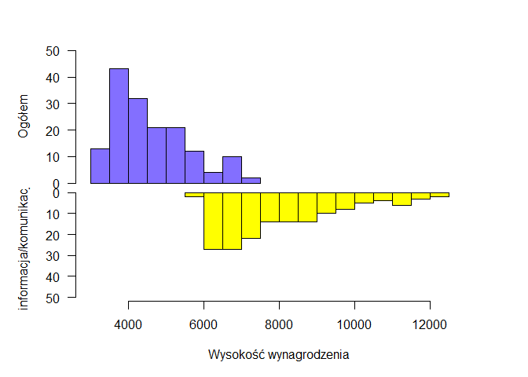
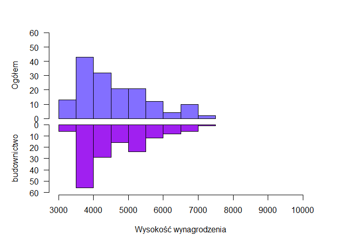
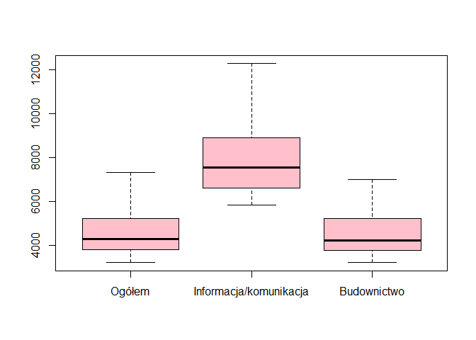
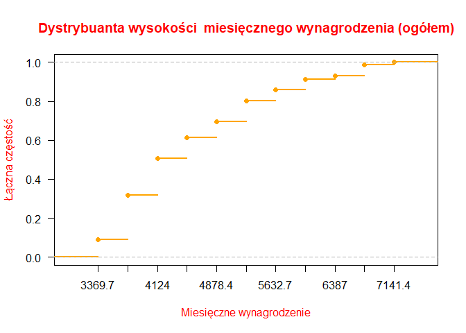
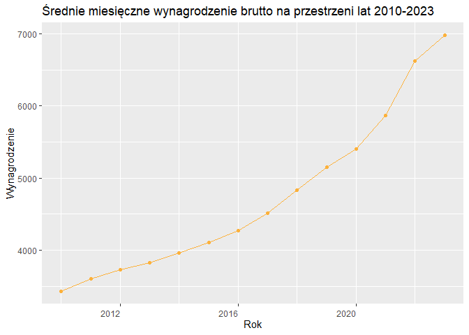

Projekt z przedmiotu STATYSTYCZNA ANALIZA DANYCH
================
Martyna Pitera
2023-05-30

## Użyte dane

Na potrzeby projektu użyłam danych pochodzących ze strony Głównego
Urzędu Statystycznego
(<https://stat.gov.pl/obszary-tematyczne/inne-opracowania/informacje-o-sytuacji-spoleczno-gospodarczej/biuletyn-statystyczny-nr-32023,4,136.html>).  
Dane te dotyczą przeciętnego miesięcznego wynagrodzenia brutto w
sektorze przedsiębiorstw. Powodem wyboru takich danych była chęć
porównania wysokości wynagrodzeń w różnych sektorach przedsiębiorstw. W
związku z moim kierunkiem studiów, chciałam poznać średnie wynagrodzenie
w sektorze informacji/komunikacji.  
W pobranym pliku .xlsx zaprezentowano średnie wynagrodzenie brutto
ogółem, ale i osobno dla każdego sektora.

Do przeprowadzenia dalszych analiz wybrałam trzy kolumny (cechy):  
1. dotycząca ogółu wszystkich sektorów,  
2. dotycząca sektora informacji/komunikacji,  
3. dotycząca sektora budownictwa.

Dane zostały wczytane przy użyciu pakietu do wczytywania tabeli z pliku
Excela. Następnie je uporządkowałam, tzn. usunęłam niepotrzebne wiersze
oraz kolumny wypełnione wartościami NULL. Powstałej w ten sposób ramce
danych nadałam nowe nazwy wierszy i kolumn.

``` r
#install.packages("readxl")
library("readxl")
zarobki <- read_excel("tabl19.xlsx")
zarobki <- as.data.frame(zarobki)
zarobki <- zarobki[-(c(1,2,3,5)),]
```

Utworzony poniżej wektor colrm zawiera liczby odpowiadające kolumnom,
które mają zostać usunięte. Inaczej mówiąc, począwszy od kolumny
trzeciej, co druga kolumna aż do dziewięćdziesiątej trzeciej ma zostać
usunięta; zawierają one jedynie wartości NULL.

Ramka danych o nazwie “zarobki” zawiera dane na temat wysokości
wynagrodzenia dla wszystkich sektorów. Ramka “zarobki1” zawiera tylko
interesujące nas kolumny.

``` r
colrm <- seq(from = 3, to = 93, by = 2)
colrm <- as.vector(colrm)
zarobki <- zarobki[,-colrm] 
zarobki <- zarobki[-1,]
rownames(zarobki) <- seq(from = 1, to = 158, by = 1)
zarobki1 <- zarobki[,c(1,2,45,33)] 
zarobki1$rok <- as.integer(substr(zarobki[,1], 1, 4))
colnames(zarobki1) <- c("Okres", "Ogółem", "Informacja/komunikacja", "Budownictwo", "rok")
```

Po wstępnej obróbce ramka danych zawierająca pożądane dane prezentuje
się jak poniżej. Oczywiście zaprezentowałam tylko 10 pierwszych wierszy,
ale w ramce danych jest ich znacznie więcej.

``` r
zarobki1[1:10,1:4]
```

    ##       Okres  Ogółem Informacja/komunikacja Budownictwo
    ## 1  2010 M01 3231.13                5932.17     3274.29
    ## 2  2010 M02 3288.29                6082.19     3222.95
    ## 3  2010 M03 3493.42                7037.23     3533.39
    ## 4  2010 M04 3398.67                6096.44     3523.25
    ## 5  2010 M05 3346.61                6111.69     3465.56
    ## 6  2010 M06 3403.65                 5845.3     3557.29
    ## 7  2010 M07 3433.32                6054.03     3583.07
    ## 8  2010 M08 3407.26                6188.29     3651.63
    ## 9  2010 M09 3403.68                6102.07      3592.8
    ## 10 2010 M10 3440.22                6181.99     3556.31

## Obliczanie wybranych parametrów statystyki opisowej

Na podstawie ramki danych zarobki1 obliczyłam 8 parametrów statystyki
opisowej dla każdej kolumny, w tym: średnią, odchylenie standardowe,
medianę, współczynnik zmienności, wariancję, dominantę, kurtozę i
skośność. Jednak by takie obliczenia były możliwe, wcześniej użyłam
funkcji as.double(), aby nadać wartościom w ramce danych odpowiedni typ
(double).

Odchylenie standardowe informuje o tym, jak szeroko wartości danej
wielkości są rozrzucone wokół jej średniej. Im mniejsza wartość
odchylenia tym obserwacje są bardziej skupione wokół średniej.

Mediana to wartość środkowa w uporządkowanym ciągu liczb. Oznacza to, że
50% danych jest mniejszych lub równych medianie, a 50% danych jest
większych lub równych medianie.

Współczynnik zmienności, podobnie jak odchylenie standardowe, należy do
miar rozproszenia, służy więc do badania stopnia zróżnicowania wartości
zmiennej. Wysoka wartość współczynnika oznacza duże zróżnicowanie cechy
i świadczy o niejednorodności badanej populacji. Interpretacja wartości
współczynnika zmienności:  
bardzo mała zmienność — poniżej 25 proc.,  
przeciętna zmienność — w przedziale od 25 proc. do 45 proc.,  
silna zmienność — od 45 proc. do 100 proc.,  
bardzo intensywna zmienność — powyżej 100 proc.

Wariancja to średnia arytmetyczna kwadratów odchyleń poszczególnych
wartości cechy jednostek zbiorowości od ich wartości średniej
(arytmetycznej) – kwadrat odchylenia standardowego.

Dominanta wskazuje, jaka wartość występuje najczęściej w zbiorze
wyników.

Skośność – miara symetrii/asymetrii rozkładu. Jeśli rozkład jest
idealnie symetryczny, wartość skośności wynosi zero. Z kolei jej
wartości ujemne wskazuję na rozkład lewoskośny (wydłużone jest lewe
ramię rozkładu), a dodatni na prawoskośny (wydłużone jest prawe ramię
rozkładu).

Kurtoza określa intensywność występowania wartości skrajnych, mierzy
więc ona, co się dzieje w “ogonach” rozkładu. Wyższa kurtoza wskazuje,
że dane mają grubsze ogony lub jest większe prawdopodobieństwo
wystąpienia wartości skrajnych. Oznacza to, że istnieje większe
prawdopodobieństwo wystąpienia obserwacji oddalonych od średniej.

``` r
zarobki1[,2] <- as.double(zarobki1[,2])
zarobki1[,3] <- as.double(zarobki1[,3])
zarobki1[,4] <- as.double(zarobki1[,4])

srednia1 <- mean(zarobki1[,2])
srednia2 <- mean(zarobki1[,3])
srednia3 <- mean(zarobki1[,4])

ochdst1 <- sd(zarobki1[,2])
ochdst2 <- sd(zarobki1[,3])
ochdst3 <- sd(zarobki1[,4])

mediana1 <- quantile(zarobki1[,2])
mediana1 <- mediana1[3]

mediana2 <- quantile(zarobki1[,3])
mediana2 <- mediana2[3]

mediana3 <- quantile(zarobki1[,4])
mediana3 <- mediana3[3]

wsp1 <- ochdst1/srednia1
wsp2<- ochdst2/srednia2 
wsp3 <- ochdst3/srednia3

war1 <- var(zarobki1[,2])
war2 <- var(zarobki1[,3])
war3 <- var(zarobki1[,4])

getmode <- function(v) {
  uniqv <- unique(v)
  uniqv[which.max(tabulate(match(v, uniqv)))]
}

dom1 <- getmode(zarobki1[,2])
dom2 <- getmode(zarobki1[,3])
dom3 <- getmode(zarobki1[,4])
```

Do obliczenia kurtozy i skośności użyłam funkcji kurtosis() i skewness()
z biblioteki “moments”.

``` r
#install.packages("moments")
library("moments")

k1 <- kurtosis(zarobki1[,2])
k2 <- kurtosis(zarobki1[,3])
k3 <- kurtosis(zarobki1[,4])

sk1 <- skewness(zarobki1[,2])
sk2 <- skewness(zarobki1[,3])
sk3 <- skewness(zarobki1[,4])
```

Następnie stworzyłam ramkę danych zawierającą obliczone wyżej parametry
(param).

``` r
param <- data.frame(średnia = c(srednia1, srednia2, srednia3),
    `odchylenie standardowe` = c(ochdst1, ochdst2, ochdst3),
    mediana = c(mediana1, mediana2, mediana3), `współczynnik zmienności[%]` = c(wsp1,
        wsp2, wsp3), wariancja = c(war1, war2, war3), dominanta = c(dom1,
        dom2, dom3), kurtoza = c(k1, k2, k3), skośność = c(sk1,
        sk2, sk3))
rownames(param) <- c("zarobki ogółem", "informacja/komunikacja",
    "budownictwo")
param
```

    ##                         średnia odchylenie.standardowe mediana
    ## zarobki ogółem         4593.923               978.9531 4298.40
    ## informacja/komunikacja 7979.005              1583.6595 7550.26
    ## budownictwo            4553.208               938.0098 4232.66
    ##                        współczynnik.zmienności... wariancja dominanta  kurtoza
    ## zarobki ogółem                          0.2130974  958349.2   3231.13 2.801419
    ## informacja/komunikacja                  0.1984783 2507977.5   5932.17 2.862943
    ## budownictwo                             0.2060107  879862.3   3274.29 2.505300
    ##                         skośność
    ## zarobki ogółem         0.8283975
    ## informacja/komunikacja 0.8571349
    ## budownictwo            0.7569491

Interpretacja wyników na przykładzie kolumny dotyczącej wynagrodzenia w
sektorze informacji/komunikacji:  

Średnie miesięczne wynagrodzenie w tym sektorze wynosi 7979.005 zł
brutto. Odchylenie standardowe przyjmuje większą wartość niż w przypadku
dwóch pozostałych obserwacji, zatem wartości wynagrodzenia w sektorze
informacji są najmocniej rozrzucone wokół średniej. Wartość środkowa
wynosi 7550.26, co oznacza, że połowa wynagrodzeń jest niższa, a druga
połowa równa lub wyższa od tej liczby. Współczynnik zmienności dla tego
sektora wynosi 0.1984783, czyli mniej niż 25% - wartości zatem wykazują
bardzo małą zmienność. Dominanta o wartości 5932.17 wskazuje najczęściej
występującą wysokość miesięcznego wynagrodzenia w tym sektorze. Kurtoza
wynosząca 2.801419 może wskazywać na grubsze ogony rozkładu. Skośność
równa 0.8571349 sugeruje pewną asymetrię w rozkładzie danych.

Patrząc na powyższą tabelę można także wysnuć ciekawy wniosek, że:  
a. średnie wynagrodzenie brutto w sektorze budownictwa nie odbiega mocno
od średniego wynagrodzenia dla ogółu sektorów,  
b. średnie wynagrodzenie dla sektora informacji/komunikacji znacznie je
przewyższa.  

## Graficzna prezentacja danych

Sporządziłam kilka wykresów, prezentujących dane. Histogram przedstawia
liczebność obserwacji w formie przedziału zmiennych. Graficzny rozkład
pozwala na stwierdzenie blisko jakich wartości istnieje najwięcej, bądź
najmniej wyników. Poniżej znajdują się dwa histogramy, umożliwiające
porównanie wynagrodzenia w sektorach informacji i budownictwa z ogólnym
wynagrodzeniem.

``` r
par(mfrow = c(2, 1))
par(mar = c(0, 5, 3, 3))
hist(zarobki1[, 2], main = "", xlim = c(3000, 13000), ylab = "Ogółem",
    xlab = "", ylim = c(0, 50), xaxt = "n", las = 1, col = "slateblue1",
    breaks = 10)
par(mar = c(5, 5, 0, 3))
hist(zarobki1[, 3], main = "", xlim = c(3000, 13000), ylab = "informacja/komunikacja",
    xlab = "Wysokość wynagrodzenia", ylim = c(50, 0), las = 1,
    col = "yellow", breaks = 10)
```

<!-- -->

``` r
par(mfrow = c(2, 1))
par(mar = c(0, 5, 3, 3))
hist(zarobki1[, 2], main = "", xlim = c(3000, 10000), ylab = "Ogółem",
    xlab = "", ylim = c(0, 60), xaxt = "n", las = 1, col = "slateblue1",
    breaks = 10)
par(mar = c(5, 5, 0, 3))
hist(zarobki1[, 4], main = "", xlim = c(3000, 10000), ylab = "budownictwo",
    xlab = "Wysokość wynagrodzenia", ylim = c(60, 0), las = 1,
    col = "purple", breaks = 10)
```

<!-- -->

Średnie zarobki dla wszystkich cech zostały również zobrazowane na
wykresie pudełkowym. Ten typ wykresu niesie ze sobą sporo różnych
informacji na temat rozkładu mierzonej zmiennej.  
Górna linia pozioma wskazuje najwyższą wartość miesięcznego
wynagrodzenia w danym sektorze, z kolei dolna linia pozioma -
najniższą.  
Górna ściana “pudełka” to trzeci kwartyl, dolna to pierwszy kwartyl, a
gruba pozioma kreska znajdująca się na “pudełku” to wartość mediany.

``` r
boxplot(zarobki1[,2:4],col='pink')
```

<!-- -->

Sporządziłam także wykres dystrybuanty empirycznej wysokości
wynagrodzenia (Ogółem). Funkcja ecdf() wyświetla punkty skokowe. Dla
“surowych” danych wykres dystrybuanty byłby nieczytelny z powodu bardzo
dużej ilości punktów skokowych. Zmniejszyłam ich liczbę poprzez
pogrupowanie danych i podział wartości na klasy. W wyniku tego działania
otrzymałam wykres dystrybuanty empirycznej nie dla pojedynczych
wartości, ale dla jedenastu przedziałów, w których poszczególne wartości
się mieszczą. Na osi poziomej znajdują się liczby będące środkami tych
przedziałów.

``` r
ecdf(zarobki1[, 2])
```

    ## Empirical CDF 
    ## Call: ecdf(zarobki1[, 2])
    ##  x[1:158] = 3231.1, 3288.3, 3346.6,  ..., 7065.6,   7330

``` r
ilosc_klas = 11
klasy = seq(min(zarobki1[, 2]) - 50, max(zarobki1[, 2]), length.out = ilosc_klas +
    1)
klasy <- round(klasy, digits = 1)
klasy
```

    ##  [1] 3181.1 3558.3 3935.5 4312.6 4689.8 5067.0 5444.1 5821.3 6198.5 6575.6
    ## [11] 6952.8 7330.0

``` r
klasy_srodki = round((klasy[-length(klasy)] + klasy[-1])/2, 1)
klasy_srodki
```

    ##  [1] 3369.7 3746.9 4124.0 4501.2 4878.4 5255.6 5632.7 6009.9 6387.0 6764.2
    ## [11] 7141.4

``` r
cut(zarobki1[, 2], klasy, dig.lab = 10)
```

    ##   [1] (3181.1,3558.3] (3181.1,3558.3] (3181.1,3558.3] (3181.1,3558.3]
    ##   [5] (3181.1,3558.3] (3181.1,3558.3] (3181.1,3558.3] (3181.1,3558.3]
    ##   [9] (3181.1,3558.3] (3181.1,3558.3] (3181.1,3558.3] (3558.3,3935.5]
    ##  [13] (3181.1,3558.3] (3181.1,3558.3] (3558.3,3935.5] (3558.3,3935.5]
    ##  [17] (3181.1,3558.3] (3558.3,3935.5] (3558.3,3935.5] (3558.3,3935.5]
    ##  [21] (3558.3,3935.5] (3558.3,3935.5] (3558.3,3935.5] (3935.5,4312.6]
    ##  [25] (3558.3,3935.5] (3558.3,3935.5] (3558.3,3935.5] (3558.3,3935.5]
    ##  [29] (3558.3,3935.5] (3558.3,3935.5] (3558.3,3935.5] (3558.3,3935.5]
    ##  [33] (3558.3,3935.5] (3558.3,3935.5] (3558.3,3935.5] (3935.5,4312.6]
    ##  [37] (3558.3,3935.5] (3558.3,3935.5] (3558.3,3935.5] (3558.3,3935.5]
    ##  [41] (3558.3,3935.5] (3558.3,3935.5] (3558.3,3935.5] (3558.3,3935.5]
    ##  [45] (3558.3,3935.5] (3558.3,3935.5] (3558.3,3935.5] (3935.5,4312.6]
    ##  [49] (3558.3,3935.5] (3558.3,3935.5] (3935.5,4312.6] (3935.5,4312.6]
    ##  [53] (3558.3,3935.5] (3935.5,4312.6] (3935.5,4312.6] (3558.3,3935.5]
    ##  [57] (3558.3,3935.5] (3935.5,4312.6] (3935.5,4312.6] (4312.6,4689.8]
    ##  [61] (3935.5,4312.6] (3935.5,4312.6] (3935.5,4312.6] (3935.5,4312.6]
    ##  [65] (3935.5,4312.6] (3935.5,4312.6] (3935.5,4312.6] (3935.5,4312.6]
    ##  [69] (3935.5,4312.6] (3935.5,4312.6] (3935.5,4312.6] (4312.6,4689.8]
    ##  [73] (3935.5,4312.6] (3935.5,4312.6] (4312.6,4689.8] (4312.6,4689.8]
    ##  [77] (3935.5,4312.6] (3935.5,4312.6] (3935.5,4312.6] (3935.5,4312.6]
    ##  [81] (3935.5,4312.6] (3935.5,4312.6] (4312.6,4689.8] (4312.6,4689.8]
    ##  [85] (3935.5,4312.6] (3935.5,4312.6] (4312.6,4689.8] (4312.6,4689.8]
    ##  [89] (4312.6,4689.8] (4312.6,4689.8] (4312.6,4689.8] (4312.6,4689.8]
    ##  [93] (4312.6,4689.8] (4312.6,4689.8] (4312.6,4689.8] (4689.8,5067]  
    ##  [97] (4312.6,4689.8] (4312.6,4689.8] (4689.8,5067]   (4689.8,5067]  
    ## [101] (4689.8,5067]   (4689.8,5067]   (4689.8,5067]   (4689.8,5067]  
    ## [105] (4689.8,5067]   (4689.8,5067]   (4689.8,5067]   (5067,5444.1]  
    ## [109] (4689.8,5067]   (4689.8,5067]   (5067,5444.1]   (5067,5444.1]  
    ## [113] (4689.8,5067]   (5067,5444.1]   (5067,5444.1]   (5067,5444.1]  
    ## [117] (5067,5444.1]   (5067,5444.1]   (5067,5444.1]   (5444.1,5821.3]
    ## [121] (5067,5444.1]   (5067,5444.1]   (5444.1,5821.3] (5067,5444.1]  
    ## [125] (5067,5444.1]   (5067,5444.1]   (5067,5444.1]   (5067,5444.1]  
    ## [129] (5067,5444.1]   (5444.1,5821.3] (5444.1,5821.3] (5821.3,6198.5]
    ## [133] (5444.1,5821.3] (5444.1,5821.3] (5821.3,6198.5] (5444.1,5821.3]
    ## [137] (5444.1,5821.3] (5444.1,5821.3] (5821.3,6198.5] (5821.3,6198.5]
    ## [141] (5821.3,6198.5] (5821.3,6198.5] (5821.3,6198.5] (6575.6,6952.8]
    ## [145] (5821.3,6198.5] (6198.5,6575.6] (6575.6,6952.8] (6575.6,6952.8]
    ## [149] (6198.5,6575.6] (6198.5,6575.6] (6575.6,6952.8] (6575.6,6952.8]
    ## [153] (6575.6,6952.8] (6575.6,6952.8] (6575.6,6952.8] (6952.8,7330]  
    ## [157] (6575.6,6952.8] (6952.8,7330]  
    ## 11 Levels: (3181.1,3558.3] (3558.3,3935.5] (3935.5,4312.6] ... (6952.8,7330]

``` r
przedzialy <- table(cut(zarobki1[, 2], klasy, dig.lab = 10))
przedzialy
```

    ## 
    ## (3181.1,3558.3] (3558.3,3935.5] (3935.5,4312.6] (4312.6,4689.8]   (4689.8,5067] 
    ##              14              36              30              17              13 
    ##   (5067,5444.1] (5444.1,5821.3] (5821.3,6198.5] (6198.5,6575.6] (6575.6,6952.8] 
    ##              17               9               8               3               9 
    ##   (6952.8,7330] 
    ##               2

``` r
ecdf(cut(zarobki1[, 2], klasy, dig.lab = 10))
```

    ## Empirical CDF 
    ## Call: ecdf(cut(zarobki1[, 2], klasy, dig.lab = 10))
    ##  x[1:11] =      1,      2,      3,  ...,     10,     11

``` r
ecdf(cut(zarobki1[, 2], klasy, dig.lab = 10))(1:ilosc_klas)
```

    ##  [1] 0.08860759 0.31645570 0.50632911 0.61392405 0.69620253 0.80379747
    ##  [7] 0.86075949 0.91139241 0.93037975 0.98734177 1.00000000

``` r
srodki_czestosci <- data.frame(`środki klas` = klasy_srodki,
    `częstości skumulowane` = ecdf(cut(zarobki1[, 2], klasy,
        dig.lab = 10))(1:ilosc_klas))
srodki_czestosci
```

    ##    środki.klas częstości.skumulowane
    ## 1       3369.7            0.08860759
    ## 2       3746.9            0.31645570
    ## 3       4124.0            0.50632911
    ## 4       4501.2            0.61392405
    ## 5       4878.4            0.69620253
    ## 6       5255.6            0.80379747
    ## 7       5632.7            0.86075949
    ## 8       6009.9            0.91139241
    ## 9       6387.0            0.93037975
    ## 10      6764.2            0.98734177
    ## 11      7141.4            1.00000000

``` r
plot(ecdf(cut(zarobki1[, 2], klasy, dig.lab = 10)), col = "orange",
    col.lab = "red", col.main = "red", xlab = "Miesięczne wynagrodzenie",
    ylab = "Łączna częstość", main = "Dystrybuanta wysokości  miesięcznego wynagrodzenia (ogółem)",
    lwd = 2, xaxt = "n", las = 1)
axis(side = 1, at = 1:ilosc_klas, labels = klasy_srodki)
```

<!-- -->

Kolejnym sporządzonym przeze mnie wykresem jest interaktywny wykres
prezentujący zmiany średnich zarobków na przestrzeni lat. Po najechaniu
myszką na wykres, pojawiają się szczegółowe informacje. Do stworzenia
tego wykresu użyłam pakietów dplyr, tidyverse oraz plotly.

``` r
#install.packages("dplyr") #bez tego pakietu funkcja %>% nie działa
#install.packages("tidyverse")
#installed.packages("plotly")

library(dplyr)
library(tidyverse)
library(plotly)

p <- (zarobki1) %>%
  group_by(rok) %>%
  mutate(srednia = mean(as.numeric(Ogółem), na.rm = T)) %>%
  slice(1) %>%
  ungroup() %>%
  ggplot(aes(x = rok)) +
  geom_point(aes(y = srednia), color="#FCB13B") +
  geom_line(aes(y = srednia), color="#FCB13B") + 
  theme(axis.text.x = element_text(angle = 0, vjust = 0.5, hjust=1)) +
  ggtitle("Średnie miesięczne wynagrodzenie brutto na przestrzeni lat 2010-2023") + 
  labs(x="Rok", y="Wynagrodzenie")
ggplotly(p)
```

<div class="plotly html-widget html-fill-item-overflow-hidden html-fill-item" id="htmlwidget-7875167eedc882919f4e" style="width:672px;height:480px;"></div>
<script type="application/json" data-for="htmlwidget-7875167eedc882919f4e">{"x":{"data":[{"x":[2010,2011,2012,2013,2014,2015,2016,2017,2018,2019,2020,2021,2022,2023],"y":[3434.98583333333,3602.41833333333,3727.95666666667,3823.10583333333,3966.77666666667,4106.10416666667,4272.46833333333,4514.52916666667,4834.84583333333,5152.78,5400.08333333333,5866.74666666667,6621.38666666667,6974.76],"text":["rok: 2010<br />srednia: 3434.986","rok: 2011<br />srednia: 3602.418","rok: 2012<br />srednia: 3727.957","rok: 2013<br />srednia: 3823.106","rok: 2014<br />srednia: 3966.777","rok: 2015<br />srednia: 4106.104","rok: 2016<br />srednia: 4272.468","rok: 2017<br />srednia: 4514.529","rok: 2018<br />srednia: 4834.846","rok: 2019<br />srednia: 5152.780","rok: 2020<br />srednia: 5400.083","rok: 2021<br />srednia: 5866.747","rok: 2022<br />srednia: 6621.387","rok: 2023<br />srednia: 6974.760"],"type":"scatter","mode":"markers+lines","marker":{"autocolorscale":false,"color":"rgba(252,177,59,1)","opacity":1,"size":5.66929133858268,"symbol":"circle","line":{"width":1.88976377952756,"color":"rgba(252,177,59,1)"}},"hoveron":"points","showlegend":false,"xaxis":"x","yaxis":"y","hoverinfo":"text","line":{"width":1.88976377952756,"color":"rgba(252,177,59,1)","dash":"solid"},"frame":null}],"layout":{"margin":{"t":43.7625570776256,"r":7.30593607305936,"b":40.1826484018265,"l":48.9497716894977},"plot_bgcolor":"rgba(235,235,235,1)","paper_bgcolor":"rgba(255,255,255,1)","font":{"color":"rgba(0,0,0,1)","family":"","size":14.6118721461187},"title":{"text":"Średnie miesięczne wynagrodzenie brutto na przestrzeni lat 2010-2023","font":{"color":"rgba(0,0,0,1)","family":"","size":17.5342465753425},"x":0,"xref":"paper"},"xaxis":{"domain":[0,1],"automargin":true,"type":"linear","autorange":false,"range":[2009.35,2023.65],"tickmode":"array","ticktext":["2012","2016","2020"],"tickvals":[2012,2016,2020],"categoryorder":"array","categoryarray":["2012","2016","2020"],"nticks":null,"ticks":"outside","tickcolor":"rgba(51,51,51,1)","ticklen":3.65296803652968,"tickwidth":0.66417600664176,"showticklabels":true,"tickfont":{"color":"rgba(77,77,77,1)","family":"","size":11.689497716895},"tickangle":-0,"showline":false,"linecolor":null,"linewidth":0,"showgrid":true,"gridcolor":"rgba(255,255,255,1)","gridwidth":0.66417600664176,"zeroline":false,"anchor":"y","title":{"text":"Rok","font":{"color":"rgba(0,0,0,1)","family":"","size":14.6118721461187}},"hoverformat":".2f"},"yaxis":{"domain":[0,1],"automargin":true,"type":"linear","autorange":false,"range":[3257.997125,7151.74870833333],"tickmode":"array","ticktext":["4000","5000","6000","7000"],"tickvals":[4000,5000,6000,7000],"categoryorder":"array","categoryarray":["4000","5000","6000","7000"],"nticks":null,"ticks":"outside","tickcolor":"rgba(51,51,51,1)","ticklen":3.65296803652968,"tickwidth":0.66417600664176,"showticklabels":true,"tickfont":{"color":"rgba(77,77,77,1)","family":"","size":11.689497716895},"tickangle":-0,"showline":false,"linecolor":null,"linewidth":0,"showgrid":true,"gridcolor":"rgba(255,255,255,1)","gridwidth":0.66417600664176,"zeroline":false,"anchor":"x","title":{"text":"Wynagrodzenie","font":{"color":"rgba(0,0,0,1)","family":"","size":14.6118721461187}},"hoverformat":".2f"},"shapes":[{"type":"rect","fillcolor":null,"line":{"color":null,"width":0,"linetype":[]},"yref":"paper","xref":"paper","x0":0,"x1":1,"y0":0,"y1":1}],"showlegend":false,"legend":{"bgcolor":"rgba(255,255,255,1)","bordercolor":"transparent","borderwidth":1.88976377952756,"font":{"color":"rgba(0,0,0,1)","family":"","size":11.689497716895}},"hovermode":"closest","barmode":"relative"},"config":{"doubleClick":"reset","modeBarButtonsToAdd":["hoverclosest","hovercompare"],"showSendToCloud":false},"source":"A","attrs":{"58b4686c3e09":{"x":{},"y":{},"type":"scatter"},"58b46abb1341":{"x":{},"y":{}}},"cur_data":"58b4686c3e09","visdat":{"58b4686c3e09":["function (y) ","x"],"58b46abb1341":["function (y) ","x"]},"highlight":{"on":"plotly_click","persistent":false,"dynamic":false,"selectize":false,"opacityDim":0.2,"selected":{"opacity":1},"debounce":0},"shinyEvents":["plotly_hover","plotly_click","plotly_selected","plotly_relayout","plotly_brushed","plotly_brushing","plotly_clickannotation","plotly_doubleclick","plotly_deselect","plotly_afterplot","plotly_sunburstclick"],"base_url":"https://plot.ly"},"evals":[],"jsHooks":[]}</script>

``` r
plot(p)
```

<!-- -->

Powyższy wykres świadczy o tym, że na przełomie ostatnich lat wysokość
przeciętnego miesięcznego wynagrodzenia stale wzrastała.

## Weryfikacja hipotez statystycznych

Przy użyciu funkcji t.test, var.test oraz cor.test zweryfikowałam trzy
typy hipotez statystycznych.

## t.test

Wynik testu t dla jednej próby służy do porównania średniej danej próby
z pewną wartością oczekiwaną.

H0: Średnia wysokość miesięcznego wynagrodzenia (Ogółem) wynosi 4500  
H1: Średnia wysokość miesięcznego wynagrodzenia (Ogółem) nie wynosi
4500  

``` r
t.test(zarobki1[,2], mu=4500)
```

    ## 
    ##  One Sample t-test
    ## 
    ## data:  zarobki1[, 2]
    ## t = 1.206, df = 157, p-value = 0.2296
    ## alternative hypothesis: true mean is not equal to 4500
    ## 95 percent confidence interval:
    ##  4440.092 4747.753
    ## sample estimates:
    ## mean of x 
    ##  4593.923

Ponieważ p-value \> 1-0.95(confidence_level), nie ma podstaw do
odrzucenia H0.

H0: Średnia wysokość wynagrodzenia (Ogółem) wynosi 3000  
H1: Średnia wysokość wynagrodzenia (Ogółem) jest większa niż 3000  

``` r
t.test(zarobki1[,2], mu=3000, alternative="greater")
```

    ## 
    ##  One Sample t-test
    ## 
    ## data:  zarobki1[, 2]
    ## t = 20.466, df = 157, p-value < 2.2e-16
    ## alternative hypothesis: true mean is greater than 3000
    ## 95 percent confidence interval:
    ##  4465.059      Inf
    ## sample estimates:
    ## mean of x 
    ##  4593.923

Ponieważ p-value \< 2.2e-16, zatem zachodzi także p-value \<
1-0.95(confidence_level).  
Odrzucamy hipotezę H0 na rzecz hipotezy alternatywnej H1.

## var.test

Kolejnym przeprowadzonym testem jest test F, służący do porównania dwóch
wariancji.

H0: Stosunek wariancji przeciętnego miesięcznego wynagrodzenia brutto
Ogółem i w sektorze budownictwa wynosi 1  
H1: Stosunek wariancji przeciętnego miesięcznego wynagrodzenia brutto
Ogółem i w sektorze budownictwa nie wynosi 1  

``` r
var.test(zarobki1[,2], zarobki1[,4])
```

    ## 
    ##  F test to compare two variances
    ## 
    ## data:  zarobki1[, 2] and zarobki1[, 4]
    ## F = 1.0892, num df = 157, denom df = 157, p-value = 0.5931
    ## alternative hypothesis: true ratio of variances is not equal to 1
    ## 95 percent confidence interval:
    ##  0.7956973 1.4909745
    ## sample estimates:
    ## ratio of variances 
    ##           1.089204

Ponieważ p-value \> 1-0.95(confidence_level), nie ma podstaw do
odrzucenia H0, co oznacza, że nie ma istotnych statystycznie różnic
między wariancjami dwóch grup.

## cor.test

Trzecim przeprowadzonym testem jest test korelacji Pearsona.

H0: Korelacja pomiędzy wysokościami miesięcznego wynagrodzenia dla
sektorów informacji/komunikacji i budownictwa wynosi 0.  
H1: Korelacja pomiędzy wysokościami miesięcznego wynagrodzenia dla
sektorów informacji/komunikacji i budownictwa nie wynosi 0.  

``` r
cor.test(zarobki1[,3], zarobki1[,4])
```

    ## 
    ##  Pearson's product-moment correlation
    ## 
    ## data:  zarobki1[, 3] and zarobki1[, 4]
    ## t = 51.234, df = 156, p-value < 2.2e-16
    ## alternative hypothesis: true correlation is not equal to 0
    ## 95 percent confidence interval:
    ##  0.9612221 0.9791524
    ## sample estimates:
    ##       cor 
    ## 0.9715472

Wynik testu korelacji Pearsona wskazuje na bardzo silny i statystycznie
istotny dodatni związek między tymi kolumnami.  
Ponieważ p-value \< 2.2e-16, a zatem także p-value \< 0.05, to odrzucamy
H0 na korzyść H1.

## Opis użytych bibliotek

Biblioteka: readxl  
Opis: Udostępnia funkcje do odczytu danych z plików Excel (.xls, .xlsx)
do ramki danych w R.  

Biblioteka: moments  
Opis: Zapewnia narzędzia do analizy statystycznej i obliczania miar
statystycznych, takich jak kurtoza, skośność itp.  

Biblioteka: dplyr  
Opis: Udostępnia zestaw funkcji do przetwarzania danych w sposób
logiczny i konkretny, np. filtrowanie, sortowanie, grupowanie, łączenie
itp. Bez tego pakietu “%\>%” nie zadziała.  

Biblioteka: tidyverse  
Opis: Zbiór pakietów, w tym dplyr, ggplot2, tidyr itp., które ułatwiają
przetwarzanie, analizę i wizualizację danych.  

Biblioteka: plotly  
Opis: Zapewnia narzędzia do tworzenia interaktywnych wykresów, które
można eksplorować i dostosowywać w przeglądarce.  

Biblioteka: stats  
Opis: Zawiera funkcje statystyczne i probabilistyczne, umożliwiające
analizę danych, testowanie hipotez, estymację parametrów, generowanie
losowych liczb oraz wiele innych operacji związanych z analizą
statystyczną.  

## Opis użytych funkcji

getwd()  
Biblioteka: base  
Opis: Zwraca bieżący katalog roboczy.  

setwd()  
Biblioteka: base  
Opis: Ustawia bieżący katalog roboczy na podany ścieżkę.  

read_excel()  
Biblioteka: readxl  
Opis: Wczytuje dane z pliku Excela do ramki danych.  

str()  
Biblioteka: base  
Opis: Wyświetla podsumowanie struktury obiektu.  

as.data.frame()  
Biblioteka: base  
Opis: Konwertuje obiekt na ramkę danych.  

seq()  
Biblioteka: base  
Opis: Generuje sekwencję liczb.  

as.vector()  
Biblioteka: base  
Opis: Konwertuje obiekt na wektor.  

rownames()  
Biblioteka: base  
Opis: Ustawia lub zwraca nazwy wierszy ramki danych.  

substr()  
Biblioteka: base  
Opis: Wybiera podciąg znaków na podstawie określonej pozycji początkowej
i końcowej.  

as.integer()  
Biblioteka: base  
Opis: Konwertuje obiekt na typ całkowitoliczbowy.  

colnames()  
Biblioteka: base  
Opis: Ustawia lub zwraca nazwy kolumn ramki danych.  

as.double()  
Biblioteka: base  
Opis: Konwertuje obiekt na liczbę zmiennoprzecinkową.  

mean()  
Biblioteka: base  
Opis: Oblicza średnią wartość z wektora.  

sd()  
Biblioteka: base  
Opis: Oblicza odchylenie standardowe z wektora.  

quantile()  
Biblioteka: base  
Opis: Oblicza kwantyle (np. medianę) z wektora.  

var()  
Biblioteka: base  
Opis: Oblicza wariancję z wektora.  

getmode()  
Biblioteka: własna definicja funkcji  
Opis: Oblicza dominanę z wektora.  

kurtosis()  
Biblioteka: moments  
Opis: Oblicza kurtozę (miarę ogona rozkładu) z wektora.  

skewness()  
Biblioteka: moments  
Opis: Oblicza skośność (miarę asymetrii rozkładu) z wektora.  

data.frame()  
Biblioteka: base  
Opis: Tworzy ramkę danych z podanych wektorów lub kolumn.  

par()  
Biblioteka: base  
Opis: Ustawia parametry dla wykresów i innych elementów graficznych.
Dzięki niej można na jednym obrazku umieścić kilka wykresów
jednocześnie.  

hist()  
Biblioteka: base  
Opis: Tworzy histogram na podstawie podanych danych.  

boxplot()  
Biblioteka: base  
Opis: Tworzy wykres pudełkowy (boxplot) na podstawie podanych danych.  

ecdf()  
Biblioteka: base  
Opis: Oblicza funkcję dystrybuanty empirycznej dla podanych danych.  

round()  
Biblioteka: base  
Opis: Zaokrągla liczby do określonej liczby miejsc po przecinku lub do
najbliższej wartości całkowitej.  

cut()  
Biblioteka: base  
Opis: Dzieli dane na przedziały (klasy) na podstawie podanych punktów
odcięcia.  

table()  
Biblioteka: base  
Opis: Tworzy tabelę częstości dla podanych danych.  

plot()  
Biblioteka: base  
Opis: Tworzy wykres na podstawie podanych danych.  

mutate()  
Biblioteka: dplyr  
Opis: Tworzy nowe zmienne lub modyfikuje istniejące w ramce danych na
podstawie obliczeń lub transformacji.  

slice()  
Biblioteka: dplyr  
Opis: Wybiera wiersze na podstawie ich pozycji lub warunków.  

ungroup()  
Biblioteka: dplyr  
Opis: Usuwa grupowanie z ramki danych, przywracając oryginalną
strukturę.  

ggplot()  
Biblioteka: ggplot2  
Opis: Tworzy obiekt wykresu ggplot, który może być dalej modyfikowany
przez dodawanie warstw i ustawianie parametrów.  

geom_point() Biblioteka: ggplot2 Opis: Dodaje punkty do wykresu na
podstawie danych.

geom_line()  
Biblioteka: ggplot2  
Opis: Dodaje linie do wykresu na podstawie danych.  

theme()  
Biblioteka: ggplot2  
Opis: Ustawia różne aspekty wyglądu wykresu, takie jak osie, tytuły
itp.  

ggtitle()  
Biblioteka: ggplot2  
Opis: Ustawia tytuł wykresu.  

labs()  
Biblioteka: ggplot2  
Opis: Ustawia etykiety osi na wykresie.  

ggplotly()  
Biblioteka: plotly  
Opis: Konwertuje wykres ggplot na interaktywną wersję plotly.  

t.test()  
Biblioteka: stats  
Opis: Wykonuje test t-studenta w celu weryfikacji hipotezy dotyczącej
średniej populacji.  

var.test()  
Biblioteka: stats  
Opis: Wykonuje test na równość wariancji między dwiema próbkami.  

cor.test()  
Biblioteka: stats  
Opis: Wykonuje test korelacji między dwiema zmiennymi.  
